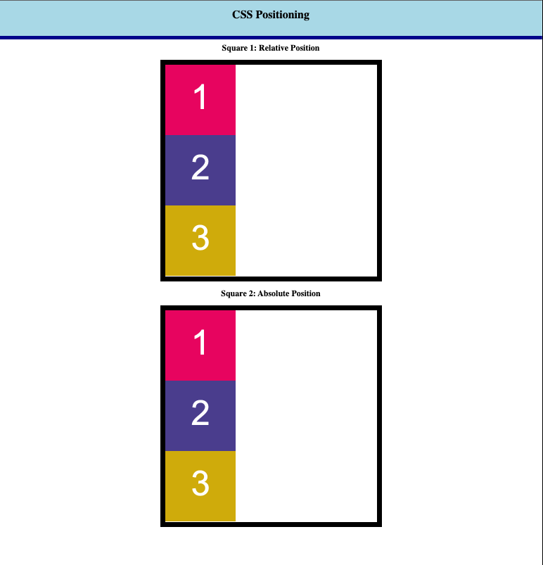

# 🏗️ Implement Absolute and Relative Positioning to Change Layout
Work with a partner to implement the following user story:
* As a developer, I want to use the CSS `position` property to change the layout of my page.

## Acceptance Criteria
The following image shows the web application's current appearance and functionality:

* It's done when `box 2` is positioned in the middle of `square 1` using relative positioning.
* It's done when `box 2` is positioned outside of the upper-right corner of `square 2` using absolute positioning.
* It's done when the finished page matches the mockup.  

## Assets
The following image demonstrates the web application's appearance and functionality:

## 💡 Hints
1. How does the CSS `position` property change the document's normal flow? 
* Positioning allows you to take elements out of normal document flow and make them behave differently, for example, by sitting on top of one another or by always remaining in the same place inside the browser viewport. This article explains the different position values and how to use them.

## 🏆 Bonus
* If you have completed this activity, work through the following challenge with your partner to further your knowledge:
* Use [Google](https://www.google.com) or another search engine to research this.

1. What is the `z-index` property? 
* The z-index property specifies the stack order of an element. An element with greater stack order is always in front of an element with a lower stack order.

## Submission
[Relative Box Positioning](https://bslockhart.github.io/Class-Activity-05-CSS-Positioning/)

---